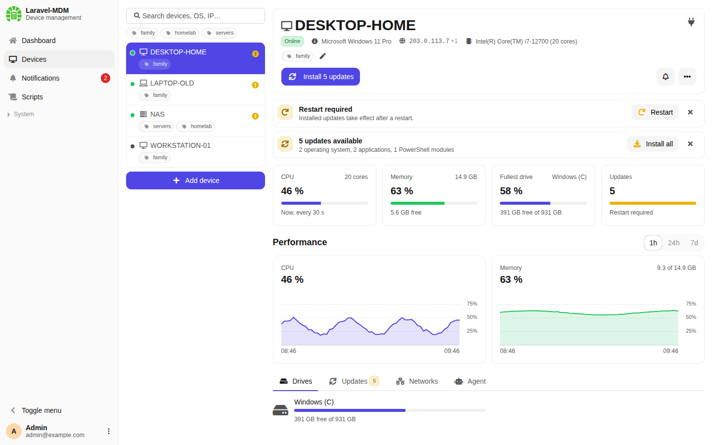
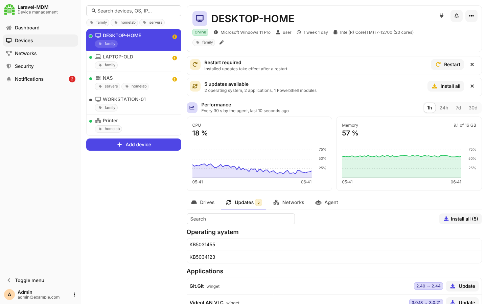
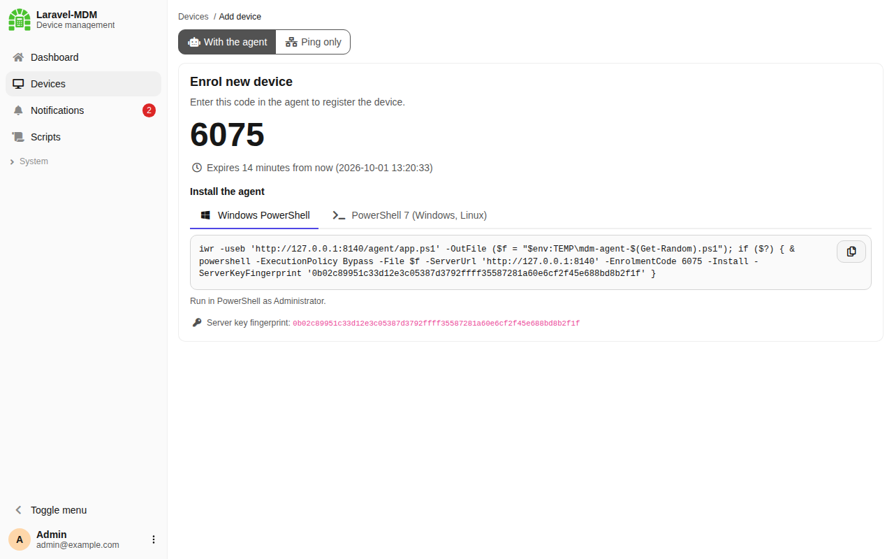
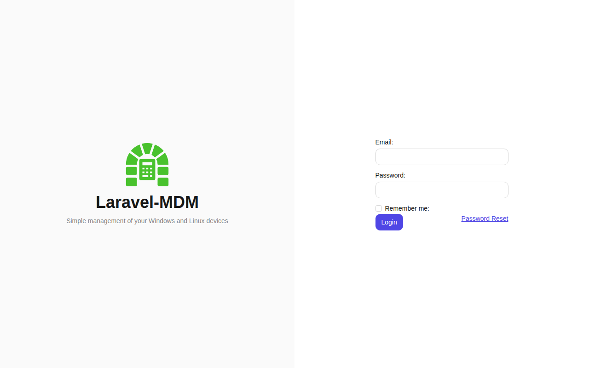
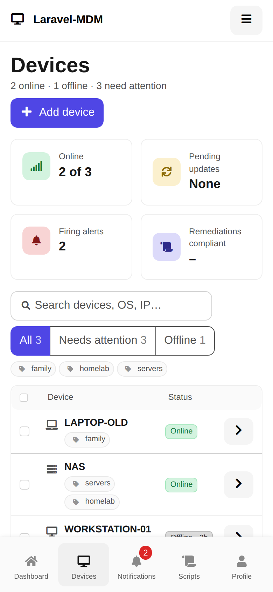

# Laravel-MDM (Mobile Device Management)

## Description

A simple system for managing your Windows and Linux (Debian / Ubuntu) computers with a self-hosted
portal and a lightweight agent written in PowerShell.

## Why I wrote this

The answer is simple: over the years, the number of computers I take care of (my girlfriend's
laptop, my work PC, …) kept growing, and it was not always easy to keep track of free disk space
or whether OS updates were installed.

## Screenshots

Device detail with status, commands and CPU/memory history:



| Pending updates | Enrolling a new device |
|---|---|
|  |  |

| Login | Mobile |
|---|---|
|  |  |

## Repository structure

| Path | Content |
|------|---------|
| `src/laravel` | Server application (Laravel) |
| `src/powershell` | Agent (Windows, Debian / Ubuntu) |
| `Dockerfile`, `docker-compose.yml`, `docker/` | Container setup |

## Server setup

```bash
cd src/laravel
composer install
cp .env.example .env
php artisan key:generate
php artisan migrate
npm install && npm run build
```

Set `APP_SYSTEM_ADMINS` in `.env` to the IDs of the users who can access the system pages.

Run the scheduler every minute (it removes CPU/RAM history older than 7 days and runs backups;
the Docker image runs it for you):

```cron
* * * * * cd /path/to/src/laravel && php artisan schedule:run >> /dev/null 2>&1
```

### Docker

A small Alpine-based image (running as a non-root user) is built by GitHub Actions and published to
`ghcr.io/gamerclassn7/laravel-mdm-server`. A single container runs everything under supervisord:

| Process | Description | Disable with |
|---------|-------------|--------------|
| nginx + PHP-FPM | Web application on port 8000, migrations run on start | `RUN_MIGRATIONS=false` skips migrations |
| Reverb | WebSocket server, served by nginx on the same port under `/app` | `REVERB_ENABLED=false` |
| Scheduler | `php artisan schedule:work` | `SCHEDULER_ENABLED=false` |

```bash
cp src/laravel/.env.example src/laravel/.env   # set DB_* and REVERB_HOST/PORT/SCHEME
docker compose --env-file src/laravel/.env up -d
```

Only port 8000 is exposed: nginx serves the web and proxies `/app` (agent WebSockets) to Reverb
inside the container. No Reverb settings are needed: the app publishes to Reverb directly inside the
container, and agents connect to the address they reach the server on (e.g. `wss://mdm.example.com`
behind a TLS proxy such as Nginx Proxy Manager with WebSocket support enabled). Set `REVERB_HOST`,
`REVERB_PORT` and `REVERB_SCHEME` only when the WebSocket is on a different public address.

On start the container waits for the database and runs the migrations. `APP_KEY`, `REVERB_APP_KEY`
and `REVERB_APP_SECRET` are generated on the first start when they are not set, and kept in
`storage/secrets.env` in the `storage` volume, so they stay the same across restarts and updates.
Values set in the environment always take precedence. Uploaded files and logs are stored in the
`storage` volume.

With `DB_CONNECTION=sqlite` and no `DB_DATABASE`, the database is kept in the `storage` volume
(`storage/database.sqlite`). A volume mounted over `/var/www/database` keeps working: its
`database.sqlite` is used, and on every start the migrations in it are replaced with the ones
from the image, so new migrations are applied after an update.

Errors always show up in `docker logs`; when `.env` sets a file channel (e.g. `LOG_CHANNEL=daily`),
the file log is kept in addition. Database backups from the system pages are not supported in the image (no
`mysqldump`).

### Real-time commands (WebSocket)

Commands (turn off, restart, install updates) are pushed to agents instantly over a WebSocket
using [Laravel Reverb](https://laravel.com/docs/reverb). Without it, commands are delivered with
the agent's next periodic report.

1. Set `REVERB_APP_KEY` and `REVERB_APP_SECRET` in `.env` to random strings.
2. Point `REVERB_HOST`, `REVERB_PORT` and `REVERB_SCHEME` to the public address the agents connect to.
3. Keep the Reverb server running, e.g. with Supervisor (the Docker image already does):

   ```bash
   php artisan reverb:start
   ```

4. Without Docker, forward the `/app` (WebSocket) and `/apps` paths to Reverb, e.g. for nginx:

   ```nginx
   location /app/ {
       proxy_http_version 1.1;
       proxy_set_header Host $http_host;
       proxy_set_header Upgrade $http_upgrade;
       proxy_set_header Connection "Upgrade";
       proxy_read_timeout 1h;
       proxy_pass http://127.0.0.1:8080;
   }

   location /apps/ {
       proxy_set_header Host $http_host;
       proxy_pass http://127.0.0.1:8080;
   }
   ```

## Agent

The agent (`src/powershell/app.ps1`) runs on Windows (Windows PowerShell 5.1 or PowerShell 7) and on
Debian / Ubuntu (PowerShell 7). It runs continuously as a scheduled task under `SYSTEM` on Windows and
as a systemd service (`laravel-mdm-agent`) running as root on Linux. It keeps a WebSocket connection
open for commands, sends a heartbeat with CPU and RAM usage every 30 seconds (over the WebSocket, or
over HTTPS when the WebSocket is unavailable) and sends a device report every 5 minutes over HTTPS.

The heartbeat also carries the fast-changing state: restart pending and the states of services and
Docker containers, only when something changed, so the portal shows a failed service or a stopped
container within 30 seconds. Everything large (updates, drives, networks, disk health, service and
container details) goes with the report over HTTPS; a state too large for a WebSocket message
(10 kB) is sent over HTTPS too. The live state is stored apart from the report in a single update,
so neither overwrites the other and the newer one is shown. Queued commands are taken with a
compare-and-swap, so a command queued while a report is processed is never lost.
A device without a heartbeat for 90 seconds is shown as offline.

The agent is designed to stay out of the way:

- it runs with below-normal priority (`Nice=10` and idle I/O priority on Linux),
- CPU and RAM usage come from plain Win32 calls (`GetSystemTimes`, `GlobalMemoryStatusEx`) on Windows
  and from `/proc/stat` and `/proc/meminfo` on Linux; CPU usage is the average over the heartbeat
  interval, so nothing is sampled in between,
- the expensive update checks (Windows Update, winget and PowerShell Gallery modules, or the local apt
  cache and modules on Linux) run every 6 hours in an idle-priority process; the result is cached in `inventory.json` and reused in reports,
- disk health (S.M.A.R.T.) is read once an hour in an idle-priority process and cached in `health.json`;
  on Linux sleeping disks are skipped (`smartctl -n standby`), so the agent never spins them up.

### Feature matrix

✅ supported · ⚠️ partly (see the note) · ❌ not supported

| Feature | Windows | Debian / Ubuntu |
|---|:---:|:---:|
| **Agent** | | |
| PowerShell | ✅ 5.1 or 7 | ✅ 7 |
| Runs as | scheduled task, `SYSTEM` | systemd service, root |
| Enrolment with a code, install commands | ✅ | ✅ |
| Remote agent update | ✅ | ✅ |
| WebSocket: instant commands, heartbeat | ✅ | ✅ |
| HTTPS fallback (heartbeat, commands) | ✅ | ✅ |
| **Monitoring** | | |
| CPU and RAM (charts) | ✅ | ✅ |
| OS, uptime, user, CPU, drives, networks | ✅ | ✅ |
| Restart pending | ✅ | ✅ |
| Battery and charging | ✅ | ✅ |
| Virtual machine / container badge | ✅ | ✅ |
| Services and their state | ✅ automatic services | ✅ systemd units |
| Docker containers | ✅ when installed | ✅ when installed |
| Disk health (S.M.A.R.T.) | ✅ | ⚠️ needs smartmontools |
| **Updates** | | |
| OS updates | ✅ Windows Update | ✅ apt (phased and held back marked) |
| Applications | ✅ winget | ✅ flatpak, snap |
| PowerShell modules (PowerShell Gallery) | ✅ Windows PowerShell and 7 | ✅ PowerShell 7 |
| Users' own PowerShell modules | ⚠️ listed only | ✅ updated as the user |
| Newer PowerShell 7 release | ✅ | ✅ |
| **Commands** | | |
| Install updates | ✅ Windows Update, winget, modules | ✅ apt, flatpak, snap, modules |
| Restart / Turn off | ✅ | ✅ |

Notes:

- Disk health is not collected on virtual machines and in containers. On Linux it needs
  `smartctl` (`apt install smartmontools`).
- On Windows the agent runs as `SYSTEM`, which cannot act as a logged-on user. Modules installed in
  a user's own profile are only listed.

Where the data comes from:

| | Windows | Debian / Ubuntu |
|---|---|---|
| Report | OS, uptime, user, CPU, battery, drives, networks, pending reboot | the same, from `/etc/os-release`, `/proc`, `df`, `ip` and `/var/run/reboot-required` |
| Updates | Windows Update, winget (any system language) | `apt list --upgradable` (phased / held back marked), flatpak (system and users), snap |
| PowerShell | outdated PowerShell Gallery modules in Windows PowerShell and PowerShell 7 (users' own ones are listed, not updated: SYSTEM cannot act as the user), a newer PowerShell 7 release | the same in PowerShell 7; users' own modules are updated as that user |
| Services | running and stopped automatic services (`Get-Service`) | running and failed units (`systemctl`) |
| Docker (when installed) | containers and their state (`docker ps --all`) | the same |
| Virtualization | manufacturer and model (Hyper-V, VMware, KVM / QEMU, VirtualBox, Xen …) | `systemd-detect-virt`, DMI (VMs and containers) |
| Power | battery level and mains power (`GetSystemPowerStatus`) | `/sys/class/power_supply` |
| Disk health | `Get-PhysicalDisk`, `Get-StorageReliabilityCounter` | `smartctl` ([smartmontools](https://www.smartmontools.org/), `apt install smartmontools`) |
| Turn off / Restart | `Stop-Computer` / `Restart-Computer` | `systemctl poweroff` / `systemctl reboot` |
| Install updates | winget (also PowerShell 7 itself), PowerShell modules, Windows Update | `apt-get upgrade --with-new-pkgs`, flatpak, snap, PowerShell modules |

The device detail has tabs for drives, updates, networks, **services** (with search, failed ones
first), **Docker** containers (only where the Docker engine is installed, not just the CLI) and
**disk health** (temperature, power-on hours, SSD wear, reallocated / pending sectors and media
errors). Virtual machines and containers get a badge with the hypervisor; disk health is not collected
or shown for them. Services, Docker and Updates have a search field. The battery shows a
charging indicator while the device is on mains power.

**Install updates** runs in the background: on Linux `apt-get upgrade --with-new-pkgs` (waits for a
running apt, installs new dependencies, removes nothing), on Windows winget, Windows Update, and on
both PowerShell module updates. Every step with its result is written to `agent.log`, the full
output of apt / winget to `updates.log`, and the update list is collected again right after.
On Linux the update list tells what apt would install now (a simulated `apt-get upgrade`, no
network): updates deferred by phasing and held back ones (pinned, held, or needing other packages
to change) are shown with an icon and do not count as available updates. The list is also
collected again a few minutes after packages are installed outside the agent (apt,
unattended-upgrades).

### Signed communication

Agents 1.7.0 and newer sign everything they send and accept only what the server signed. The
signatures are RSA-3072 (PKCS#1 v1.5, SHA-256) and are checked with plain .NET, which works in
Windows PowerShell 5.1 and PowerShell 7 without extra modules. HTTPS still keeps the content
private; the signatures make sure nothing was forged or changed on the way, in the database or on
the device's disk.

- **Server key:** `storage/mdm-signing.key`, created on the first start (`php artisan mdm:signing-key`
  shows its fingerprint) and never stored in the database. Keep it in the backup of the storage
  volume: without it agents accept no more updates or commands and have to be reinstalled.
  `/agent/app.ps1` is served with the public key filled in, so a new or updated agent pins it on
  its first start. The install commands also pass `-ServerKeyFingerprint`, and **Add device** shows
  the fingerprint.
- **Device key:** created on the device and never sent anywhere; the server stores only the public
  key. On Windows it is a non-exportable CNG machine key (with a DPAPI-protected file as a fallback),
  on Linux a root-only file.
- **Requests:** every request of the agent is signed with the device key over the method, path,
  time, a one-time nonce and the body hash. The server rejects unsigned, changed, replayed and stale
  requests (more than 5 minutes off; the agent corrects its clock from signed server responses).
- **Responses:** every response is signed with the server key for exactly that request (its nonce),
  error responses included. The agent ignores anything else.
- **WebSocket:** a command event is only a trigger signed by the server. The agent then takes the
  commands over the signed API, so nothing can be injected or replayed over the WebSocket.
  Heartbeats sent over the WebSocket are signed with the device key.
- **Agent updates:** the agent downloads the new version into memory, checks its signature
  (`/agent/app.ps1.sig`) and only then writes it to disk.

The agent keeps the pinned key and its settings in `config.json`, which only `SYSTEM` / root and
administrators can read. The server has no way to change this file. Agents older than 1.7.0 keep
working, but they only get **Update agent**. After updating, the agent pins the key embedded in
the new version and registers its device key once. The device detail shows **Signed** or
**Unsigned agent**. System admins can reset a device key, for example after the agent was
reinstalled with a new key. `MDM_REQUIRE_SIGNED_AGENTS=true` rejects unsigned agents entirely;
they then have to be reinstalled.

### Remediation scripts

**Scripts** in the main menu (system admins only) lists the scripts in a data table (search, sorting, **Add** in a modal). Each script has a detail page with its code, fingerprint and all runs. The scripts are PowerShell, in the style of Intune remediations:

- **Detection script** (required): exit 0 means compliant, exit 1 means the remediation should run.
- **Remediation script** (optional): runs after a detection that exited with 1, then the detection
  runs again. Without a remediation, exit 1 means failed.
- Each script targets **All**, **Windows** or **Linux** and has a timeout (up to 1 hour).

The code is entered as text and stored byte for byte. Its **fingerprint** (SHA-256 over the
platform, the timeout and the hashes of both scripts) changes with every code change, and a new
version is created. **Run** opens a list of the devices with checkboxes. Devices on another
platform, agents that do not sign and devices with scripts disabled cannot be selected. Opened
again, the list has the devices of the last run selected. Offline devices run the script when they
come back within 24 hours. The results are shown under the script and in the **Scripts** tab of
the device: status, exit codes and up to 16 kB of output.

Security:

- **Only a trigger:** `runScripts` carries no data. The agent takes its runs over the signed API.
- **Signed manifest per run:** every run has a manifest signed with the server key, for this
  device and this run, valid for 24 hours. The agent checks the signature, the device, the expiry,
  that the run id was not executed before, the platform and the SHA-256 of both scripts, and only
  then runs anything. A rejected run is reported back with the reason.
- **Memory only:** the code is never written to disk and never on a command line. A separate
  low-priority process reads it from stdin and checks its hash again. Scripts run one at a time,
  are killed at the timeout, and run as `SYSTEM` / root.
- **No network access:**
  - On Linux the script runs in an empty network namespace (`unshare --net`, also for every
    process it starts). Without `unshare` it does not run.
  - On Windows it runs from a copy of `powershell.exe` (`%ProgramData%\Laravel-MDM\sandbox`)
    that Windows Firewall rules block in both directions. It does not run when the rules are
    missing or changed, or the firewall is off for a profile.
  - This is defense in depth, not a hard boundary: a script running as `SYSTEM` / root that sets
    out to reach the network can get around it. For example, on Linux it can enter the network
    namespace of PID 1; on Windows it can start another program from System32. DNS lookups on
    Windows go through the DNS Client service. The signature is what keeps foreign code out.
    The isolation keeps scripts from downloading or sending anything.
- **Local switch:** `-DisableScripts` (`-EnableScripts` to allow them again, or `scripts_enabled`
  in `config.json`) turns scripts off on the device. The server cannot change it.
- **Audit:** creating, changing, removing and running a script (with its fingerprint and devices)
  is written to the audit log.

### Dashboard

`/dashboard` (menu **Dashboard**) is a configurable dashboard from
[steelants/laravel-boilerplate.dashboard](https://packistry.sa-dev.cz/public): every user can create
their own dashboards, share them, and add, resize and move widgets in the editor. A shared
**Overview** dashboard is created by a migration with the **Devices** widget (online and offline
devices right now, the offline ones listed, refreshed every 30 seconds). Owners edit their
dashboards; system admins (`APP_SYSTEM_ADMINS`) can edit every dashboard
(`App\Policies\DashboardPolicy`).

New widgets are Blade components in `app/View/Components/Widgets` and show up in the editor
automatically. The package comes from the `packistry` Composer repository configured in
`composer.json`.

### Installation

Click **Add device** in the portal. It shows the enrolment code and ready-made install commands with
a copy button:

- **Windows PowerShell** – run in PowerShell as Administrator,
- **PowerShell 7** – run in pwsh as Administrator on Windows, or with `sudo pwsh` on Debian / Ubuntu
  ([install PowerShell](https://learn.microsoft.com/powershell/scripting/install/install-ubuntu)).

The command downloads the agent from the server (`/agent/app.ps1`, the version matching the server)
to a temporary file and runs its installer, which copies the agent to `%ProgramData%\Laravel-MDM`
on Windows or `/opt/laravel-mdm` on Linux (`-InstallPath` to change), enrols the device and installs
the service:

```powershell
iwr -useb 'https://mdm.example.com/agent/app.ps1' -OutFile ($f = "$env:TEMP\mdm-agent-$(Get-Random).ps1"); if ($?) { & powershell -ExecutionPolicy Bypass -File $f -ServerUrl 'https://mdm.example.com' -EnrolmentCode 1234 -Install }
```

Running the command on a device where the agent is already installed only updates it: the existing
token is kept, the device is not enrolled again and no enrolment code is needed.

The installer needs administrator rights (Administrator on Windows, root via `sudo` on Linux). It
checks them first and stops without using up the enrolment code when they are missing.
 Set `AGENT_DOWNLOAD_URL` to download it from elsewhere, e.g. a GitHub release.

Manually:

```powershell
.\app.ps1 -ServerUrl https://mdm.example.com -EnrolmentCode 1234 -Install
```

Optional parameters (stored in the scheduled task / service by `-Install`):

| Parameter | Default | Description |
|-----------|---------|-------------|
| `-ReportInterval` | `300` | Seconds between device reports |
| `-HeartbeatInterval` | `30` | Seconds between heartbeats (with CPU/RAM) |
| `-InventoryInterval` | `21600` | Seconds between update checks |
| `-HealthInterval` | `3600` | Seconds between disk health (S.M.A.R.T.) checks |
| `-ReverbScheme` | scheme of `-ServerUrl` | `https` (wss) or `http` (ws) |
| `-ReverbHost`, `-ReverbPort`, `-ReverbKey` | from server | Override the WebSocket address announced by the server |
| `-NoRealtime` | | Use HTTPS only, without the WebSocket |

The device detail shows whether the agent is connected over the **WebSocket** (heartbeat in the last
90 s), the **REST API** (report in the last 11 min) or both, the agent version, and the device type
(server, laptop or desktop, detected by the agent).

When the server serves a newer agent than the device runs, the detail shows an **Update agent** button
and the update command to copy. The button only asks the agent to update itself; the message carries
no command or data. The agent then:

- downloads `/agent/app.ps1` from the `-ServerUrl` it was installed with (never from an address in the
  message), and only over HTTPS (plain HTTP is accepted for localhost only),
- rejects a script that does not parse or is not newer than the running version (no downgrades),
- replaces itself and restarts.

Agents older than 1.1.0 cannot update themselves and have to be reinstalled via **Add device**.

The token is stored next to the script (`Token.xml` on Windows, `token` readable by root only on
Linux) and logs are written to `agent.log`. The agent only executes the commands `turnOff`, `restart`,
`doUpdates` and `updateAgent`.

### Uninstalling

Windows (PowerShell as Administrator):

```powershell
Stop-ScheduledTask -TaskName 'Laravel-MDM-Agent'
Unregister-ScheduledTask -TaskName 'Laravel-MDM-Agent' -Confirm:$false
Remove-Item -Recurse -Force "$env:ProgramData\Laravel-MDM"
# The device key (agents 1.7.0+) is a CNG machine key outside that folder.
$provider = [Security.Cryptography.CngProvider]::MicrosoftSoftwareKeyStorageProvider
if ([Security.Cryptography.CngKey]::Exists('Laravel-MDM-Agent', $provider, 'MachineKey')) {
    [Security.Cryptography.CngKey]::Open('Laravel-MDM-Agent', $provider, 'MachineKey').Delete()
}
```

Linux:

```bash
sudo systemctl disable --now laravel-mdm-agent
sudo rm -f /etc/systemd/system/laravel-mdm-agent.service && sudo systemctl daemon-reload
sudo rm -rf /opt/laravel-mdm
```

Agents older than 1.1.0 ran from the folder they were started in, not from the install directory.
The scheduled task shows where: `(Get-ScheduledTask Laravel-MDM-Agent).Actions.Arguments`; delete
that folder (`app.ps1`, `Token.xml`, `agent.log`, `inventory.json`) instead. Then delete the device
in the portal.
